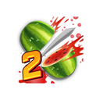
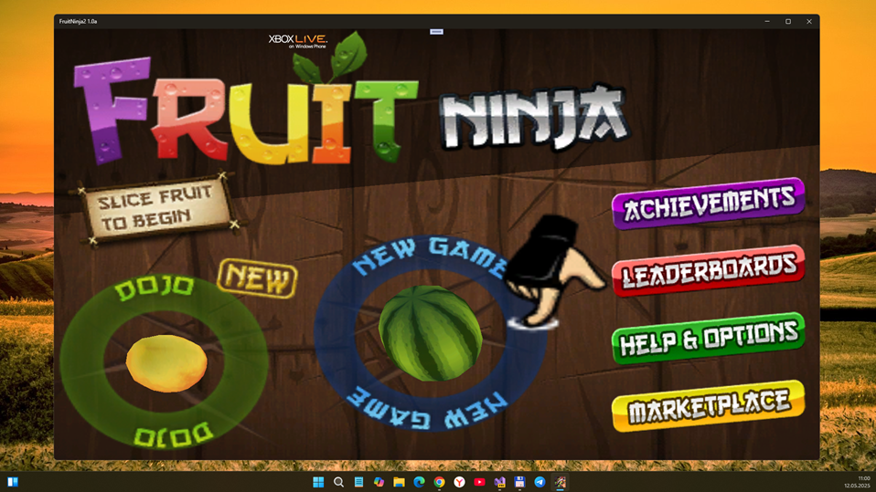
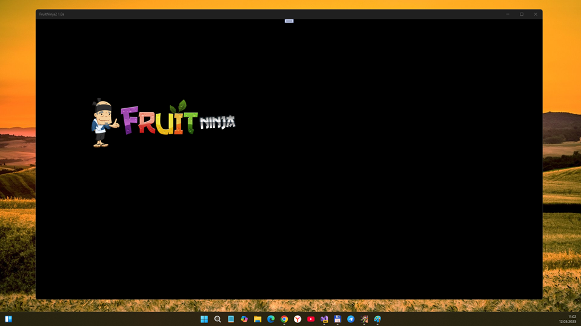
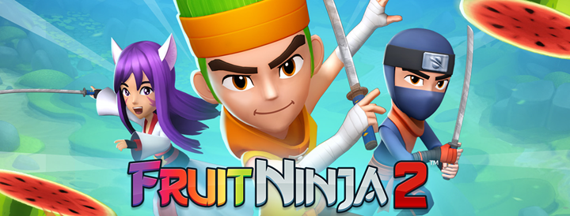

# FruitNinja2 1.0-alpha - uwp branch 

Planned "UWP-remake" of Fruit Ninja (1+2) game project. 

## Intro 
Today I asked a question, was the Fruit Ninja 2 game released for Windows Phone? It turned out that there is only some strange 3D version of the game for Android with very bad reviews. There is a theme https://4pda.to/forum/index.php?showtopic=963723 (in Russian) at the 4PDA Technoforum. 
Here are a couple of posts from there:

" Mes_360: Just damn all the worst that could have been done:

1) There are coins and crystals;

2) Social activities - there are;

3) Levelling - there is;

4) And there is a design that matches all similar games.;
Surely a permanent Internet connection is also necessary

raincandy_U: Mes_360, it says Online, so you need a permanent connection. The game has completely collapsed. "

I looked at this mess and decided to step in. 

Anyway, I'm starting to make a kind of fusion of Fruit Ninja 1 and 2. I'm not much of a graphic designer, but I'll come up with something =) 
There are plans to keep 2D and a lightweight interface.

## Screenshots

## Status
- UWP app - only template (draft / early bird -- not for game run!)
- Min. Win. SDK = 10240, and Win. SDK 19041 used
- Alpha version (but save game data not reconstructed yet, and screen scaling problems not fixed)

## ToDo
- Fix R.E. bugs & update content(s)
- Simplify UI (cut all Xbox live deals - achiev., etc.)
- Add some cool music theme :) 
- Add popular world-wide languages (Russian, Chinese, etc.) 

## .
As is. No support. DIY. Learn purposes only.

## Reference(s)
- https://yandex.com/games/app/278766 

## ..
[m][e] 2025

